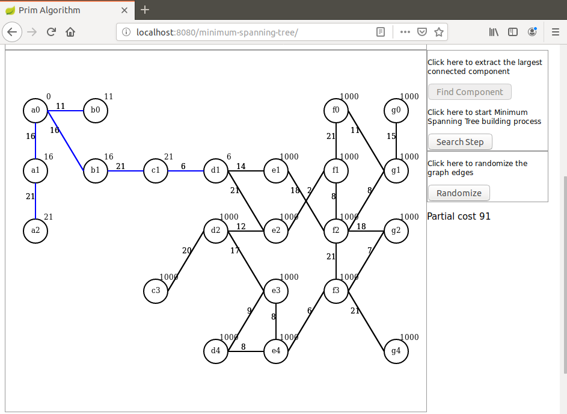

# prim-step
I present here a Java based demonstration of Minimum Spanning Tree Prim algorithm using HTML5 Canvas, Javascript and AJAX.

The algorithm itself is implemented in Java, Javascript is only used for initialization and display on Canvas.

First an undirected graph is randomly created and its largest connected component is extracted (Java side).

Then a minimum spanning tree is build stepwise (Java side) and the graph is redrawn at each step (browser side).

To launch the demo run this command: `mvn spring-boot:run`.
When the application has started open a browser and hit the URL: `localhost:8080/minimum-spanning-tree`.

Here are some screenshots that can be seen during the demo.

After graph initialization:

After the component was found:

After the end of the animation:

For a demonstration of the Kruskal minimum spanning tree algorithm please visit these repositories:

https://github.com/dubersfeld/kruskal-anim

https://github.com/dubersfeld/kruskal-step

Dominique Ubersfeld, Cachan, France
